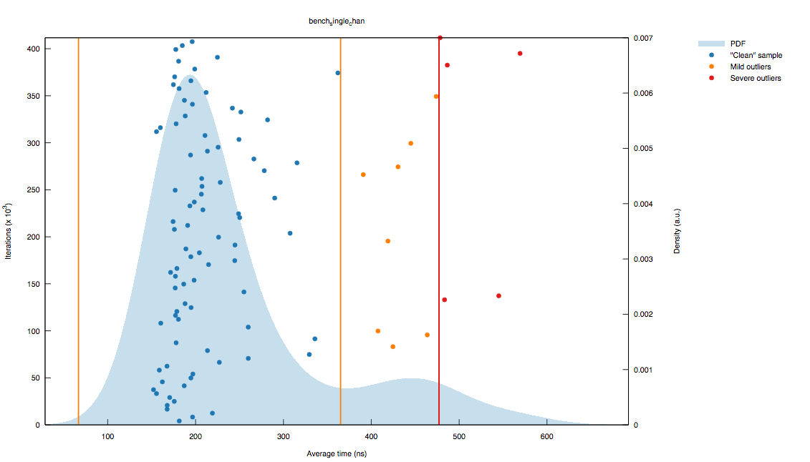
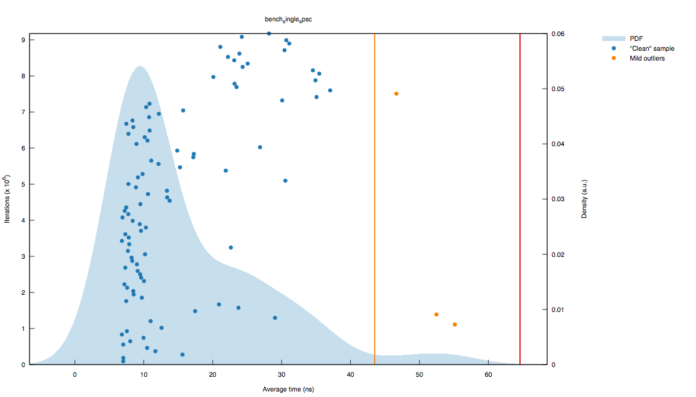
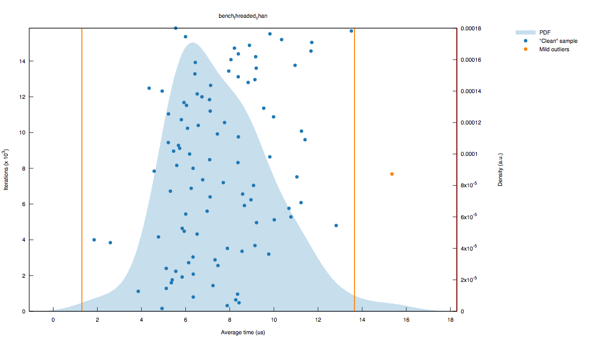
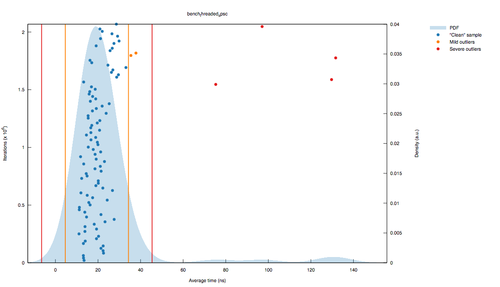

## Bounded SPSC Queue

This crate provides a very simple bounded, Single-producer Single-consumer (SPSC)
queue for Rust.  It provides a data structure for two threads to communicate
in one direction with minimal overhead and bounded semantics.

Compared to a `sync_channel` (which is a MPSC queue under the covers), bounded-spsc-queue
provides a small but consistent speedup.

## Documentation

Documentation can be found here](http://polyfractal.github.io/bounded-spsc-queue/bounded_spsc_queue/index.html)

## Example

```rust
use std::thread;
use bounded_spsc_queue::{Producer, Consumer};

// Initialize a queue with capacity of 500 values
let (p, c) = bounded_spsc_queue::make(500);

// Spawn a new thread and move the Producer into it
thread::spawn(move|| {
  for i in 0..100000 {
    p.push(i);
  }
});

// Back in the first thread, start pop'ing values off the queue
for i in 0..100000 {
  let t = c.pop();
  assert!(t == i);
}
```

## Semi-scientific Benchmarks
On my Macbook Air (dual-core 1.7 GHz Intel Core i7), `sync_channel` can perform
single threaded `send()/recv()` paired operations in ~1μs.  



`spsc` performs the same test in ~200ns.


A more realistic, although harder test to accurately benchmark, is threaded
performance.  This test spins up a "listener" thread which attempts to drain
the queue as fast as possible.  It must intermittently check and Atomic flag
to determine if the test is over, which unfortunately will impact the benchmark results.
To help alleviate the impact, the listener will only check every 500 iterations.

In the original thread, the bencher attempts to push data onto the queue.
This is where timing can get flaky: if the listener is not draining fast enough,
the producer may stall while waiting for the queue to free a spot.  This test
should not be viewed as a latency test, but more as a throughput test since
it is really testing both producer and consumer performance in conjunction.

`sync_channel` scores ~8μs on this test:



While `spsc` scores ~160ns:



A second set of benchmarks look at the inverse (secondary thread pushes onto the
queue continuously, while the main thread pops data off).  The timings are very
similar.
